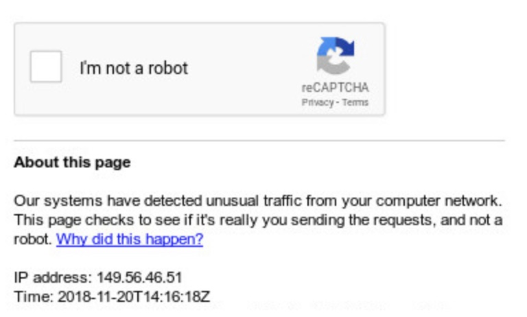

# Exploring Google Hacking Techniques

> What is Google Dorking?

origin site: https://securitytrails.com/blog/google-hacking-techniques

Some time ago we wrote an interesting post about the [OSINT](https://securitytrails.com/blog/what-is-osint-how-can-i-make-use-of-it) concept and its importance in the security researching world, showing how easy it is to get information from publicly available sources on the Internet.

Last week one of our developers shared an interesting link he found — one that was exposing many supposedly “private” resources from different websites.

That’s when someone from our team suggested a post about this kind of data exposure issue. We’ve mentioned this type of security problem in previous posts, as it’s a common source for security researchers to find valuable private information about any website.

Today we are going to dig into Google hacking techniques, also known as Google Dorks.

## What is a Google Dork?

A Google Dork, also known as Google Dorking or Google hacking, is a valuable resource for security researchers. For the average person, Google is just a search engine used to find text, images, videos, and news. However, in the infosec world, Google is a useful hacking tool.

How would anyone use Google to hack websites?

Well, you can’t hack sites directly using Google, but as it has tremendous web-crawling capabilities, it can index almost anything within your website, including sensitive information. This means you could be exposing too much information about your web technologies, usernames, passwords, and general vulnerabilities without even knowing it.

In other words: Google “Dorking” is the practice of using Google to find vulnerable web applications and servers by using native Google search engine capabilities.

Unless you block specific resources from your website using a robots.txt file, Google indexes all the information that is present on any website. Logically, after some time any person in the world can access that information if they know what to search for.

Important note: while this information is publicly available on the Internet, and it is provided and [encouraged](https://support.google.com/websearch/answer/2466433?hl=en) to be used by Google on a legal basis, people with the wrong intentions could use this information to harm your online presence.

Be aware that Google also knows who you are when you perform this kind of query For this reason and many others, it’s advised to use it only with good intentions, whether for your own research or while looking for ways to defend your website against this kind of vulnerability.

While some webmasters expose sensitive information on their own, this doesn’t mean it’s legal to take advantage of or exploit that information. If you do so you’ll be marked as a cybercriminal. It’s pretty easy to track your browsing IP, even if you’re using a VPN service. It’s not as anonymous as you think.

Before reading any further, be aware that Google will start blocking your connection if you connect from a single static IP. It will ask for captcha challenges to prevent automated queries.

​																											**Graph: reCAPTCHA**

## Popular Google Dork operators

Google’s search engine has its own built-in query language. The following list of queries can be run to find a list of files, find information about your competition, track people, get information about SEO backlinks, build email lists, and of course, discover web vulnerabilities.

Let’s look at the most popular Google Dorks and what they do.

- `cache`: this dork will show you the cached version of any website, e.g. `cache: securitytrails.com`
- `allintext`: searches for specific text contained on any web page, e.g. `allintext: hacking tools`
- `allintitle`: exactly the same as allintext, but will show pages that contain titles with X characters, e.g. `allintitle:"Security Companies"`
- `allinurl`: it can be used to fetch results whose URL contains all the specified characters, e.g: allinurl client area
- `filetype`: used to search for any kind of file extensions, for example, if you want to search for jpg files you can use: `filetype: jpg`
- `inurl`: this is exactly the same as `allinurl`, but it is only useful for one single keyword, e.g. `inurl: admin`
- `intitle`: used to search for various keywords inside the title, for example, `intitle:security tools` will search for titles beginning with “security” but “tools” can be somewhere else in the page.
- `inanchor`: this is useful when you need to search for an exact anchor text used on any links, e.g. `inanchor:"cyber security"`
- `intext`: useful to locate pages that contain certain characters or strings inside their text, e.g. `intext:"safe internet"`
- `link`: will show the list of web pages that have links to the specified URL, e.g. `link: microsoft.com`
- `site`: will show you the full list of all indexed URLs for the specified domain and subdomain, e.g. `site:securitytrails.com`
- `*`: wildcard used to search pages that contain “anything” before your word, e.g. `how to * a website`, will return “how to…” design/create/hack, etc… “a website”.
- `|`: this is a logical operator, e.g. `"security" "tips"` will show all the sites which contain “security” or “tips,” or both words.
- `+`: used to concatenate words, useful to detect pages that use more than one specific key, e.g. `security + trails`
- `–`: minus operator is used to avoiding showing results that contain certain words, e.g. `security -trails` will show pages that use “security” in their text, but not those that have the word “trails.”

If you’re looking for the complete set of Google operators, you can follow this [SEJ post](https://www.searchenginejournal.com/google-search-operators-commands/215331/)which covers almost every known dork available today.